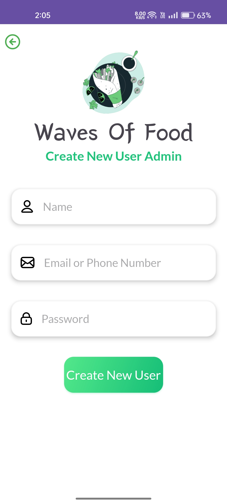

# 👋 Hi I'm Rahul (App Developer) 
# My Food Ordering App - Admin

Welcome to my advanced food Ordering app, crafted in Kotlin, integrating cutting-edge technologies and design principles to provide users with a seamless and delightful culinary experience.

## Key Features

- **Secure User Authentication:** Implemented with Firebase Authentication for a robust and safe user experience.
- **Real-time Database Integration:** Leverages Firebase Realtime Database for efficient data storage and retrieval.
- **Efficient Image Loading:** Incorporates the Glide image library for optimized and smooth image loading.
- **Modular Fragment Architecture:** Utilizes Android Fragments for modular, reusable, and maintainable components.
- **Model-View-ViewModel (MVVM) Architecture:** Adopts MVVM architecture for a clean and organized separation of concerns.
- **Sleek Material Design:** Embraces Material Design principles, providing a modern and visually appealing user interface.

## Features in user app
-> User can add to cart food
-> User can increase and decrease item quantity and delete
-> User can see order status
-> User can see orders history
-> User can see notifications
-> User can see account details and update
-> User can view popular food items
-> User can search any item

## Features in admin app
->Admin can add food item
-> Admin can see all items and increase and decrease item quantity and delete item
-> Admin can see all pending order and order details and accept order and dispatch order
-> Admin can add new user
-> Admin can see whole time earning
-> Admin can see all completed order
-> Admin can see account details and update

## 🔗 Project References

https://github.com/denzcoskun/ImageSlideshow

https://firebase.google.com/

## 🚀 About Me
I'm Rahul Mavaliya, a dedicated app developer with a passion for crafting innovative solutions. Proficient in Kotlin, I specialize in creating robust and user-friendly applications. Committed to staying at the forefront of technology, I strive to deliver seamless and engaging user experiences through my work.

## Screenshots

